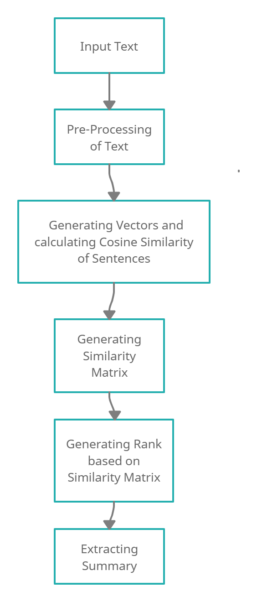
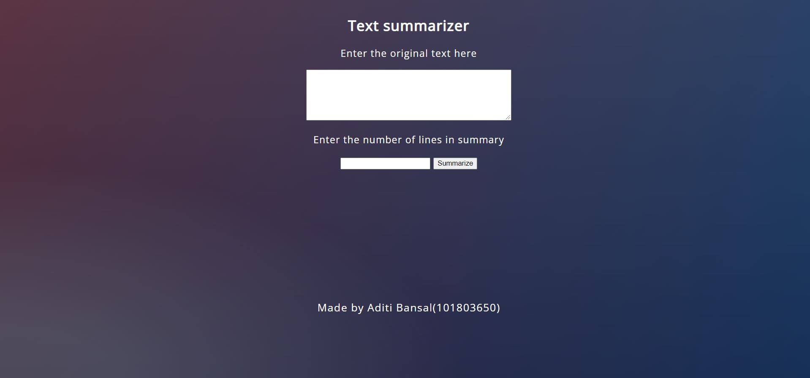
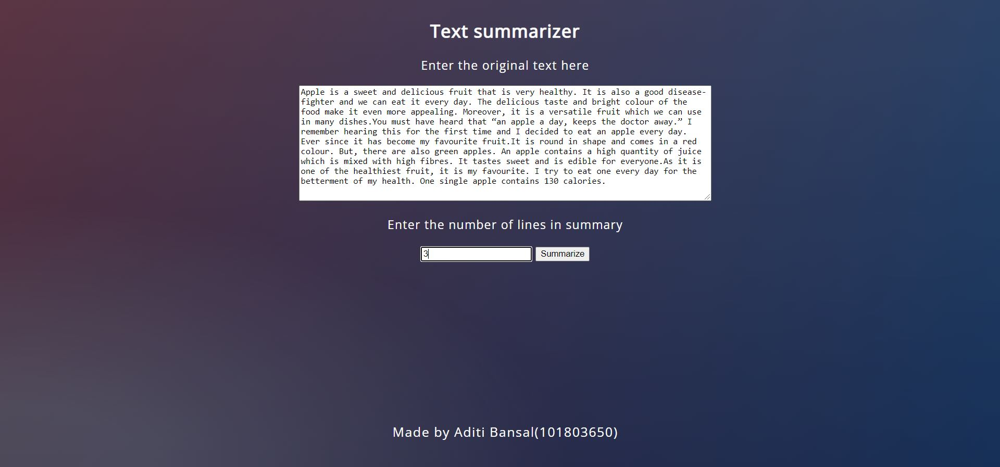
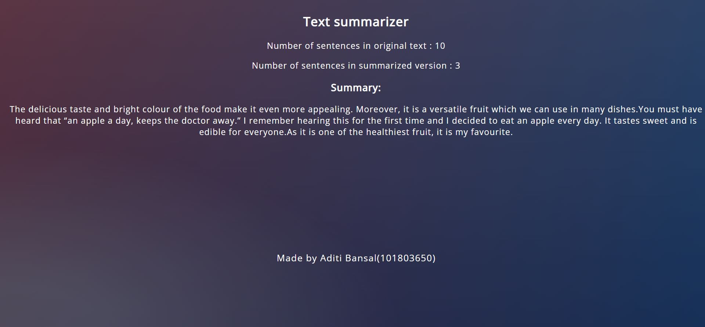

# Generating Summary of given Text : Project Overview🎯
## Problem Statement
Summaries reduce reading time. When researching documents, summaries make the selection process easier. Automatic summarization improves the effectiveness of indexing. Automatic summarization algorithms are less biased than human summarizers. Reading a summary help us to identify the interest area, gives a brief context of the story.
Hence this summary generator can help in automation of the process and make it more effective and unbiased.

## Natural Language Processing (NLP) and Machine Learning problem
Generating summary of a specific number of lines from the given text. 
* Type : Unsupervised Learning
* Task : Similarity Matrix (Cosine Similarity)

## Tools and Technologies used🛠
* Windows 10 OS
* Python 3.7.12
* Pandas
* Numpy
* Malplotlib
* Sklearn
* Nltk
* Networkx
* Flask
* HTML
* CSS
* BootStrap
* Deployed on Heroku cloud

## Methodology

## Result
A web application to summarize the given text into a specific number of lines using unpervised learning.

Live app :- https://text-summary-aditi-101803650.herokuapp.com/

## Novelty
I have used textrank as an approach to rank the sentences based on calculated cosine similarity. TextRank does not rely on any previous training data and can work with any arbitrary piece of text and it is a general purpose graph-based ranking algorithm for NLP.
